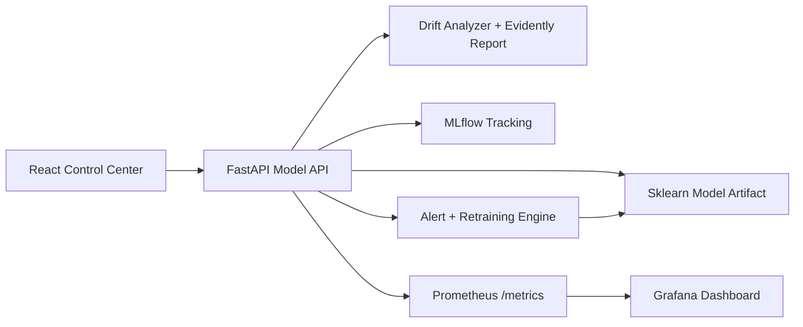

# Real-Time MLOps Drifting & Monitoring System

A production-style MLOps portfolio project that serves a predictive model, monitors live quality and data drift, raises alerts, and triggers retraining when model performance falls below the configured threshold.

Repository target: [tirth1263/real-time-ml-ops-drifting-and-monitoring-system](https://github.com/tirth1263/real-time-ml-ops-drifting-and-monitoring-system)

## What It Demonstrates

- FastAPI model serving with live prediction, simulation, alert, retraining, and drift-report APIs.
- ReactJS control center with functional dashboard, drift lab, prediction console, experiment tracking, and operations pages.
- Prometheus metrics for accuracy, drift score, prediction volume, latency, active alerts, and retraining events.
- Grafana provisioning with a ready-made MLOps overview dashboard.
- MLflow experiment tracking for every model training run.
- Evidently AI HTML drift report generation when the backend dependencies are installed.
- Docker Compose stack for API, React app, Prometheus, Grafana, and MLflow.
- CI workflow for backend tests and frontend production build.

## Architecture



## Quick Start With Docker

```bash
docker compose up --build
```

Then open:

- React UI: <http://localhost:5173>
- FastAPI docs: <http://localhost:8000/docs>
- Prometheus: <http://localhost:9090>
- Grafana: <http://localhost:3000> (`admin` / `admin`)
- MLflow: <http://localhost:5000>

## Local Development

Backend:

```bash
cd backend
python -m venv .venv
.venv\Scripts\activate
pip install -r requirements.txt
uvicorn app.main:app --reload --port 8000
```

Frontend:

```bash
cd frontend
npm install
npm run dev
```

## Functional Flow

1. The backend trains or loads a baseline conversion model.
2. The UI sends prediction requests and drift simulations to FastAPI.
3. Simulated batches include ground truth so the monitor can calculate live accuracy.
4. The drift analyzer compares the current batch against the serving reference profile.
5. If accuracy drops below the threshold, an alert is created and retraining is triggered.
6. Retraining logs metrics to MLflow, saves a new model artifact, and updates Prometheus gauges.
7. Grafana visualizes model health from Prometheus.

## Key API Routes

- `GET /api/status` - live model, drift, alert, and history state.
- `POST /api/predict` - score one consumer-trend event.
- `POST /api/traffic/simulate` - feed baseline or drifted traffic into the monitor.
- `POST /api/retrain` - manually retrain the model.
- `PUT /api/settings` - update thresholds and auto-retrain behavior.
- `GET /api/drift/report` - generate and download the latest HTML drift report.
- `GET /metrics` - Prometheus scrape target.

## Portfolio Notes

This project is designed to show that the model is only one piece of a real ML system. It includes serving, monitoring, model quality checks, drift diagnostics, alerting, retraining, experiment tracking, and deployment infrastructure.
