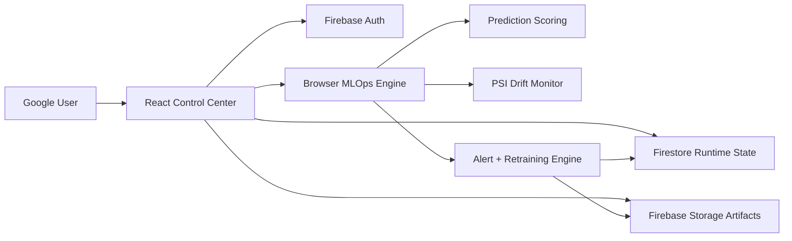

# Real-Time MLOps Drifting & Monitoring System

A Firebase-first React MLOps portfolio app that serves a predictive model, simulates production traffic drift, monitors model quality, raises alerts, writes model state to Firestore, uploads model/report artifacts to Firebase Storage, and supports Google sign-in.

Repository: [tirth1263/real-time-ml-ops-drifting-and-monitoring-system](https://github.com/tirth1263/real-time-ml-ops-drifting-and-monitoring-system)

Live hosting target: [ml-ops-drift-monitoring-system.web.app](https://ml-ops-drift-monitoring-system.web.app)

## What It Demonstrates

- Google authenticated ReactJS command center.
- Client-side logistic-regression serving for consumer purchase prediction.
- Drift simulation for baseline, mild drift, severe drift, and trend shift traffic.
- Population Stability Index monitoring across model features.
- Accuracy, F1, ROC AUC, drift score, alert, and retraining history tracking.
- Firestore persistence under each authenticated user's workspace.
- Firebase Storage uploads for versioned model JSON artifacts and HTML drift reports.
- Firebase Hosting deployment with SPA rewrites.
- Firestore and Storage security rules scoped by authenticated user ID.

## Architecture



## Functional Flow

1. Sign in with Google.
2. The app initializes a baseline model if the user has no Firestore runtime document.
3. Predictions are scored through the local MLOps engine using the active model weights.
4. Drift simulations generate synthetic consumer-trend batches with ground truth labels.
5. The monitor calculates live accuracy, F1, and PSI drift scores against the reference profile.
6. Alerts are created when quality or drift thresholds are breached.
7. Retraining creates a fresh model version and uploads the artifact to Firebase Storage.
8. Firestore stores the latest runtime state, history, alerts, settings, events, and training runs.

## Local Development

```bash
cd frontend
npm install
npm run dev
```

The Vite dev server prints a local URL, usually `http://localhost:5173`.

## Firebase Configuration

The app reads Firebase values from Vite env vars and falls back to the included public Firebase web config:

```bash
VITE_FIREBASE_API_KEY=...
VITE_FIREBASE_AUTH_DOMAIN=...
VITE_FIREBASE_PROJECT_ID=...
VITE_FIREBASE_STORAGE_BUCKET=...
VITE_FIREBASE_MESSAGING_SENDER_ID=...
VITE_FIREBASE_APP_ID=...
VITE_FIREBASE_MEASUREMENT_ID=...
```

Google sign-in, Firestore, Storage, and Hosting should be enabled in the Firebase project.

If the Firebase CLI reports that Storage has not been set up, open the Storage page in the Firebase console, click **Get Started**, keep the default bucket, then deploy the storage rules:

```bash
npx firebase-tools deploy --only storage
```

## Deploy

```bash
cd frontend
npm install
npm run build
cd ..
npx firebase-tools deploy --only hosting,firestore:rules,storage
```

## Project Notes

The app intentionally does not require Docker. The `backend`, `monitoring`, and `docker-compose.yml` files remain as optional reference material from the original stack, while the working hosted app is fully Firebase-backed.
